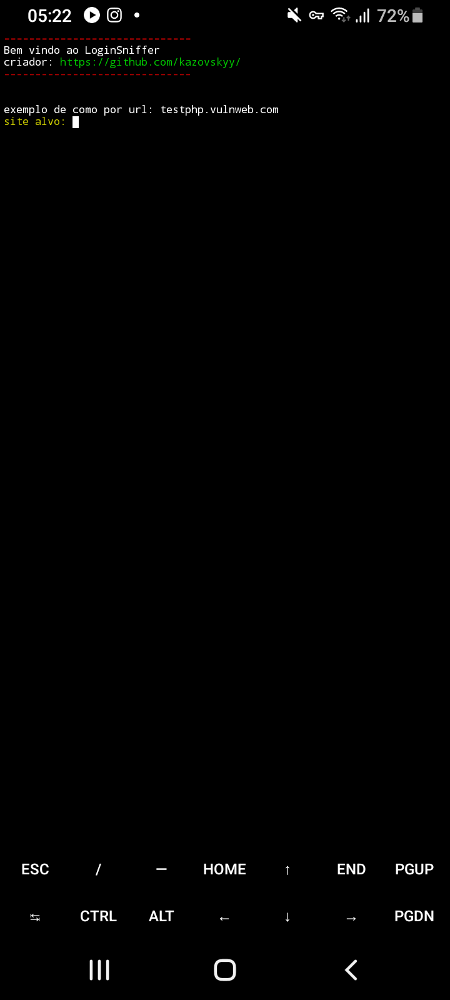
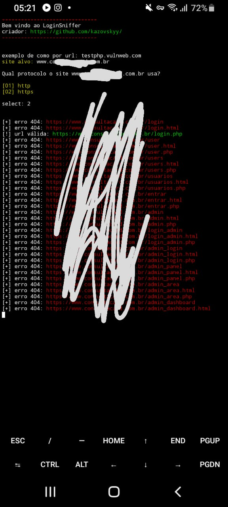

# LoginSniffer
Login Sniffer é uma ferramenta simples feita em python que busca páginas de login de administrador em websites
# Como usar?
Quando iniciar a ferramenta, ponha a url do site sem o protocolo, para evitar mal funcionamento ou bugs na ferramenta, exemplo: **urlexemplo.com** evite colocar o simbolo de / no final da url tambem
# Instalação
```
apt update && apt upgrade -y

pkg install git

pkg install python

git clone https://github.com/kazovskyy/LoginSniffer/

cd LoginSniffer

pip install -r requirements.txt

python LoginSniffer.py
```
# Screenshots


***saiba que esta ferramenta foi feita exclusivamente para termux e pode nao funcionar em outros lugares, por ser bem simples pode apresentar mal funcionamento, o criador nao se responsabiliza se for usada de forma indevida, use apenas para fins educativos***
